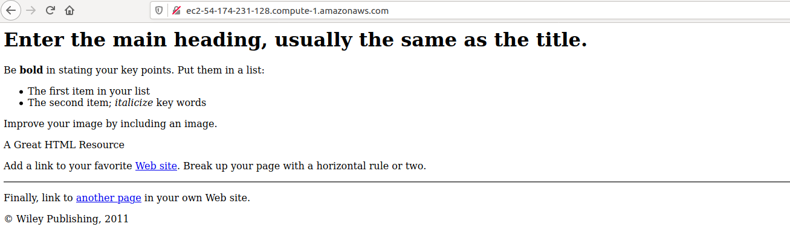

# Packer Ansible Demo
> Here, in this demo we are going to build an AMI Image for AWS using Hashicorp Packer and create an EC2 Instance Using Ansible with Packer built AMI ID.

## Table of contents
* [General info](#general-info)
* [Screenshots](#screenshots)
* [Technologies](#technologies)
* [Setup](#setup)
* [Description](#description)
* [Usage](#usage)
* [Status](#status)
* [Contact](#contact)

## General info
Create an AWS EC2 Instance from our custom built image using packer from a base image in AWS. In the custom image we are going to install nginx and create a sample html file using Ansible as CM Tool. We use Ansible to spin up ec2 instance from using packer buit ami id. Once completed we can copy public ip in browser new tab our configured html page will appear.   

## Screenshots




## Technologies
* Ubuntu  - version 18.04.5 LTS
* Ansible - version 2.9.16
* Packer  - version 1.6.6 
* Python  - version 3.6.9

## Setup
These Installation steps are for only Ubuntu 18.04.5 LTS but links for setup on Differesnt OS are given below.

### Python
### [Install Python3 on Ubuntu](https://www.knowledgehut.com/blog/data-science/install-python-on-ubuntu)

### [Install Python3 on RHEL](https://developers.redhat.com/blog/2018/08/13/install-python3-rhel/)

### [Install Python3 on MacOS](https://www.dummies.com/programming/python/how-to-install-python-on-a-mac/)

### Ansible

The following steps are to Install Ansible on Ubuntu 18.04.5 LTS
```shell
sudo apt update
sudo apt install software-properties-common
sudo apt-add-repository --yes --update ppa:ansible/ansible
sudo apt install ansible
```

### [Install Ansible on Different OS](https://docs.ansible.com/ansible/latest/installation_guide/intro_installation.html)

### Packer

The following steps are to install Hashicorp Packer on Ubuntu 18.04.5 LTS

```shell
curl -fsSL https://apt.releases.hashicorp.com/gpg | sudo apt-key add -
sudo apt-add-repository "deb [arch=amd64] https://apt.releases.hashicorp.com $(lsb_release -cs) main"
sudo apt-get update && sudo apt-get install packer
```

### [Install Packer on Different OS](https://learn.hashicorp.com/tutorials/packer/getting-started-install)


## Description

We have main playbook ec2_packer_terraform.yml and it consists of two roles

* create_ami_image
  In this role we are creating a directory packer_demo to copy our scripts and yaml files.
  ami_packer.json is our packer build file in Json which creates AMI Image and Provision  nginx using Ansible.
  install_nginx.yml will provision nginx on our image
  index.html is a sample static html webiste to host after configuring nginx

* run_ec2_instance
  In this role we are provisioning the ec2 instance form the image that we created using packer
  We used ec2_instance ansible module to provision instance
  
* group_vars/all
  In this directory we have vars.yml and secrets.yml file
  All Variables are kept in vars.yml file
  aws_access_key and aws_secret_key is kept in secrets.yml file and encrypted using ansible-vault


## Usage

ansible-playbook ec2_packer_terraform.yml -e "ansible_python_interpreter=/usr/bin/python3" --ask-vault-pass


## Status
Code is: _Working_ 

## Author
Authored by  - feel free to contact me!